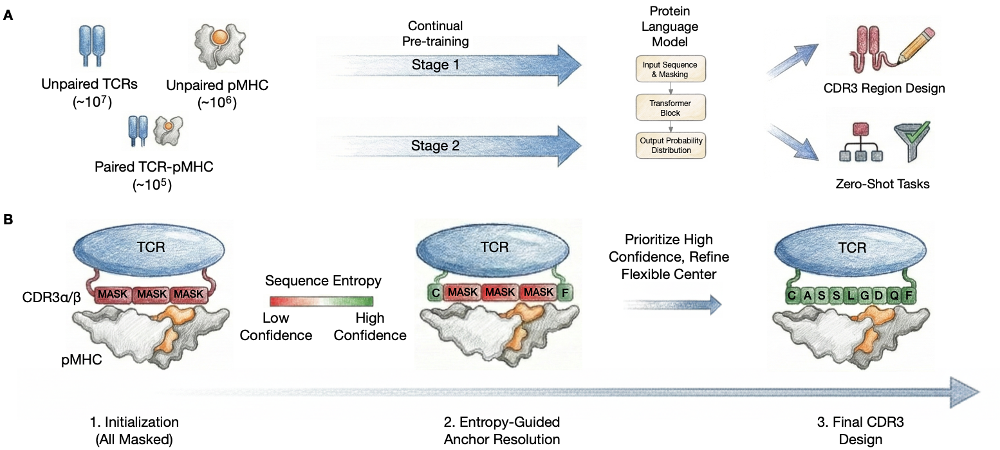
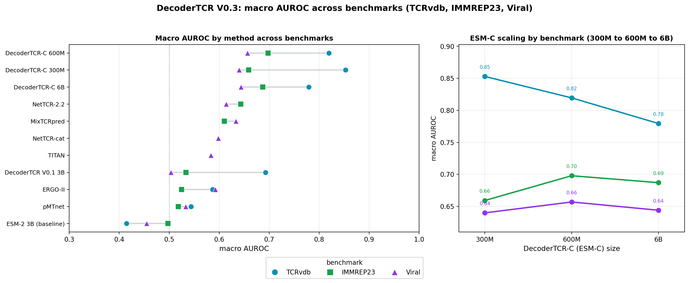
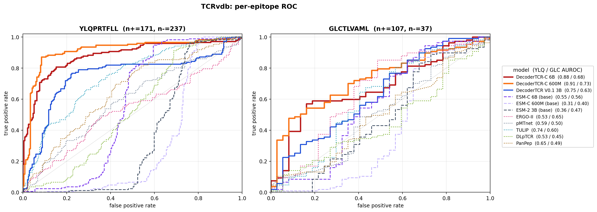
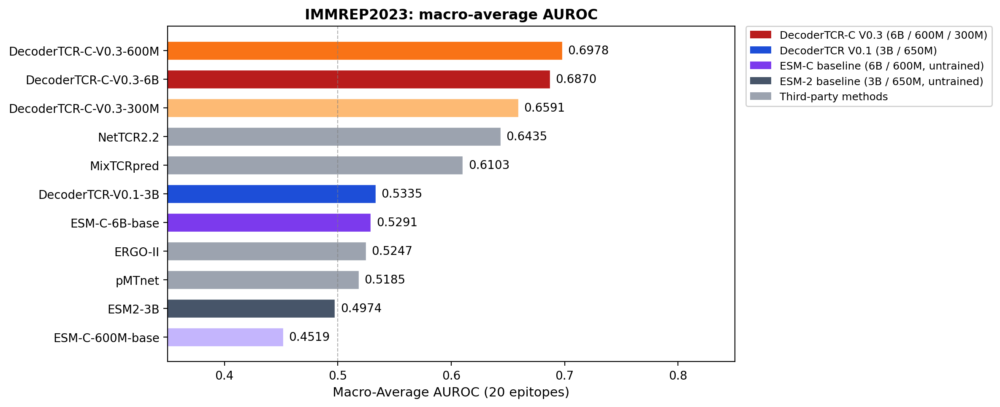
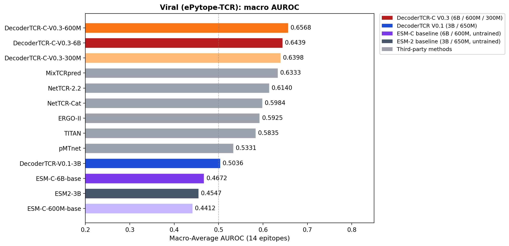
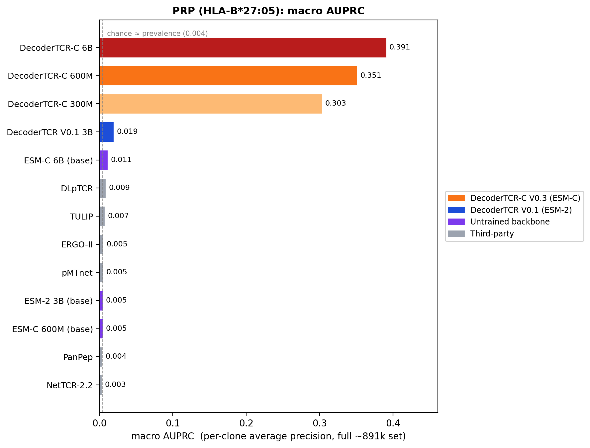
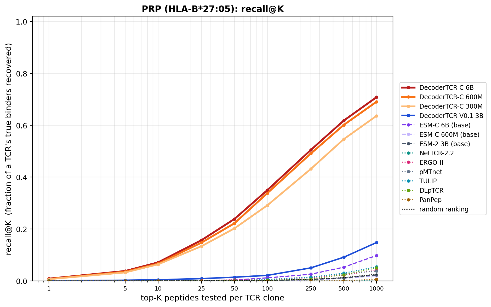
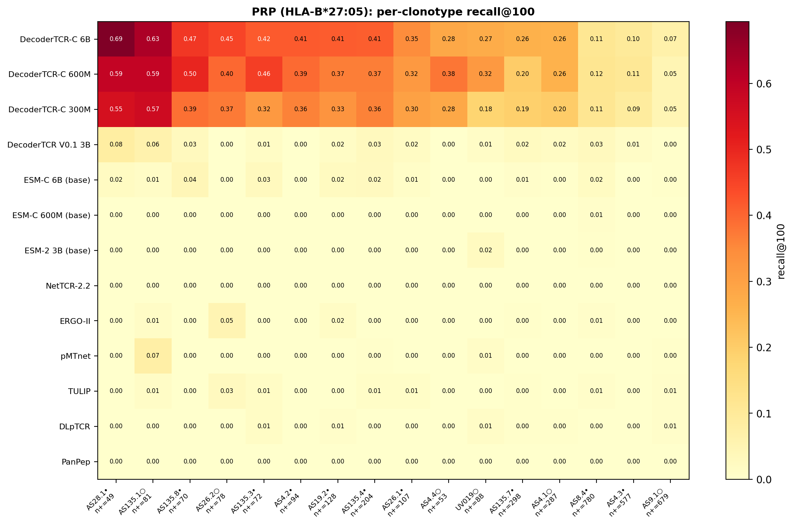

# DecoderTCR (V0.3)

**DecoderTCR** is a masked protein language model for TCR-pMHC interactions, built on
compositional continual pre-training.  DecoderTCR for prediction and design is introduced in:
([DecoderTCR: Compositional Pretraining and Entropy-Guided Decoding for TCR-pMHC Interactions](
https://openreview.net/pdf?id=yzes8qBM70)).




## What's new in V0.3

- **New V0.3 models on the ESMC backbone and an updated masking strategy.** DecoderTCR-ESMC models at 300M, 600M, and 6B parameters.
  `DecoderTCR-ESMC_600M` is the default model and runs on common GPUs (≤24 GB). 300M is lighter, and 6B
  is a larger variant for 80 GB GPUs (see the note below).
- **A comprehensive evaluation across different TCR recognition tasks.** Four benchmarks
  spanning seen and novel TCRs, scored by both per-epitope AUROC and retrieval (recall@K /
  AUPRC): TCRvdb, IMMREP23, Viral (ePytope-TCR), and PRP (a HLA-B\*27:05 peptide-library
  screen). Figures are under [`results/`](results/).
- **VDJ-based input wrapper support.** A convenient input format for high-throughput screening.
- **Python API support** (`dt.score_from_components`, `dt.embed`) alongside the CLIs.

## Models

| Name | Backbone | Params | Version | Note |
|---|---|---|---|---|
| `DecoderTCR-ESMC_600M` | ESMC | 600M | V0.3 | **default**, runs on ≤24 GB GPUs |
| `DecoderTCR-ESMC_300M` | ESMC | 300M | V0.3 | lightest |
| `DecoderTCR-ESMC_6B`   | ESMC | 6B   | V0.3 | larger variant (80 GB GPU), see note below |
| `DecoderTCR_3B`     | ESM2 | 3B   | V0.1 | legacy model |
| `DecoderTCR_650M`   | ESM2 | 650M | V0.1 | legacy model |

Select a model with `-m <name>` (or `model=` in the API). Omitting it uses the default
`DecoderTCR-ESMC_600M`. Weights are fetched by
[`scripts/download_weights.py`](scripts/download_weights.py), see [Checkpoints](#checkpoints).

> **On `DecoderTCR-ESMC_6B`.** The 6B model is a larger variant for 80 GB GPUs, and is not the recommended
> default. On most AUROC benchmarks it matches 600M. For antigen recognition in the PRP retrieval screen,
> where we seek to identify a TCR's true peptide binders, 6B performs better (higher recall@K and AUPRC, see
> [Results](#results)). For everyday use, 600M is the recommended default.

> **Licensing.** The DecoderTCR code and all released weights are MIT-licensed. The bundled
> ESMC backbone follows the Chan Zuckerberg Biohub release (https://github.com/Biohub/esm).
> ESM2 is MIT (Meta). See [`LICENSE.md`](LICENSE.md).

## Installation

```bash
uv sync                                       # Python 3.12, package + both backbones + gene reconstruction
uv run stitchrdl -s human                     # fetch IMGT germline data (for V/J-gene scoring)
uv run python scripts/download_weights.py     # fetch model weights (see Checkpoints)
```

Stitchr is installed by default. ESM2 imports as `esm`, ESMC as `esmc`.

## Usage

Input format: **V/J genes + CDR3s + HLA allele + peptide**:

### Python API

A single pair (a dict in, a one-row DataFrame out):

```python
import DecoderTCR as dt

result = dt.score_from_components(
    {"trav": "TRAV21", "traj": "TRAJ6", "cdr3a": "CAVRPGGAGPFFVVF",
     "trbv": "TRBV7-9", "trbj": "TRBJ2-7", "cdr3b": "CASSLGQAYEQYF",
     "hla": "HLA-B*27:05", "peptide": "LRVMMLAPF"},
    device="cuda:0")
print(result["pll_DecoderTCR-ESMC_600M"].iloc[0])
```

Batch mode (a list of dicts, or a CSV / DataFrame):

```python
import DecoderTCR as dt
import pandas as pd
scored = dt.score_from_components(pd.read_csv("pairs.csv"), device="cuda:0")
scored.to_csv("scored.csv", index=False)
```

Each row is reconstructed and scored. The returned DataFrame adds the reconstructed
HLA_a/HLA_b/TCR_a/TCR_b, and a `pll_<model>` column.

### Command line

A single pair (components as flags):

```bash
python -m DecoderTCR.utils.predict_from_genes \
    --trav TRAV21 --traj TRAJ6 --cdr3a CAVRPGGAGPFFVVF \
    --trbv TRBV7-9 --trbj TRBJ2-7 --cdr3b CASSLGQAYEQYF \
    --hla 'HLA-B*27:05' --peptide LRVMMLAPF -d cuda:0
```

Batch mode (a CSV in, a scored CSV out):

```bash
python -m DecoderTCR.utils.predict_from_genes -i pairs.csv -o scored.csv -d cuda:0
```

Columns and flags are case-insensitive with aliases: `trav, traj, cdr3a, trbv, trbj, cdr3b,
hla, peptide` (optional `name, label`). The TCR chains are stitched with
[stitchr/thimble](https://github.com/JamieHeather/stitchr) from IMGT germlines including the
leader (matching the training distribution), and HLA_a/HLA_b are looked up by allele from the
training reference. Gene names accept IMGT (`TRAV21`, `TRBV7-9`), allele-suffixed
(`TRBV7-9*01`), leading-zeroed (`TRBV07-09`), family or wildcard (`TRBV12`), and IMMREP
(`TCRBV07-09`) forms. A row whose allele is outside the reference, or whose genes and CDR3 do
not stitch to a clean chain, gets a NaN score and a populated `*_reason`. List available
alleles with `dt.list_alleles()`. Sample input:
[`Demo/sample_data/genes_pairs.csv`](Demo/sample_data/genes_pairs.csv). Walkthrough:
[`Demo/quick_start.ipynb`](Demo/quick_start.ipynb).

### Running on CPU

For scoring or an embedding run on CPU, pass `device="cpu"` (API) or `-d cpu` (CLI). The CLIs
default to CPU when no GPU is present. Weights load in fp32 on CPU and scores match GPU.

```python
scored = dt.score_from_components(pd.read_csv("pairs.csv"),
                                  model="DecoderTCR-ESMC_300M", device="cpu")
```
```bash
python -m DecoderTCR.utils.predict_from_genes -i pairs.csv -o scored.csv \
    -m DecoderTCR-ESMC_300M -d cpu
```

Set `OMP_NUM_THREADS` to the core count. The smaller models are much faster on CPU. The 6B is
impractical on CPU, so use a GPU for the 6B model.

### Embeddings

`dt.embed` returns backbone embeddings for the reconstructed complexes: one mean-pooled vector
per complex (`pool="mean"`), a per-region dict (`pool="regions"`), or the full per-residue
array (`pool=None`).

```python
import DecoderTCR as dt
import pandas as pd
df      = dt.score_from_components(pd.read_csv("pairs.csv"), device="cuda:0")
emb     = dt.embed(df, model="DecoderTCR-ESMC_600M")                  # (N, d) mean-pooled per complex
regions = dt.embed(df, model="DecoderTCR-ESMC_600M", pool="regions")  # list of {region: (d,)} per complex
per_res = dt.embed(df, model="DecoderTCR-ESMC_600M", pool=None)       # list of (L_i, d), one vector per residue
```

## Results

We evaluate DecoderTCR-ESMC zero-shot, with no epitope-specific training, on four benchmarks that
span known TCRs, novel TCRs, and the antigen-discovery setting. Together they show the model
recovers TCR-pMHC recognition from sequence alone, each reported with its standard metric.
Figures and the per-benchmark index are in [`results/`](results/).

### At a glance

Across three diverse benchmarks, DecoderTCR-ESMC performs strongly in macro AUROC (shown as one marker per method per benchmark, with an ESMC scaling panel on the right). The PRP benchmark is detailed separately below.



*Macro AUROC by method on each of the three balanced benchmarks (left), and ESMC scaling from 300M to 6B per benchmark (right). DecoderTCR-ESMC sits at the top throughout.*

### TCRvdb: recognition on known TCRs

TCRvdb ([Messemaker et al., bioRxiv 2025](https://doi.org/10.1101/2025.04.28.651095)) is a functionally validated TCR-pMHC database. We scored two well-characterized epitopes (YLQ, GLC) by masked-peptide likelihood alone, without supplying binding labels.

The model consistently ranks true binders above decoys (per-epitope ROC: fine-tuned models are solid lines, untrained backbones are dashed, third-party tools are dotted). This suggests the pretraining objective effectively captures TCR-pMHC specificity. Because these TCRs were present in the training data, this serves as a recognition check rather than a generalization test. This is also the one setting where scaling to larger models does not yield improvements, as larger networks can begin to memorize the training data and saturate learning early.



*Per-epitope ROC on TCRvdb (YLQ, GLC), scored label-free on seen TCRs. Fine-tuned DecoderTCR models (solid) against untrained backbones (dashed) and third-party tools (dotted), with per-model AUROC in the legend.*

### IMMREP23: generalization to novel TCRs

The IMMREP23 community challenge
([Nielsen et al., *ImmunoInformatics* 2024](https://doi.org/10.1016/j.immuno.2024.100045))
measures generalization to largely unseen TCRs. Performance is scored as per-epitope AUROC over 20 epitopes against purpose-built specificity tools. DecoderTCR-ESMC demonstrates robust generalization compared to baseline methods when applied zero-shot.



*Macro-average AUROC over the 20 IMMREP23 epitopes, one bar per method, with the ESMC size series highlighted.*

### Viral epitopes: an independent external benchmark

The ePytope-TCR benchmark ([Drost et al., *Cell Genomics* 2025](https://www.cell.com/cell-genomics/fulltext/S2666-979X(25)00202-2))
scores roughly twenty published tools on viral-epitope specificity. DecoderTCR-ESMC maintains strong, competitive performance compared to existing tools in this zero-shot evaluation.



*Per-method macro-average AUROC on the ePytope-TCR viral benchmark (missing predictions scored at 0.5), with the ESMC size series highlighted.*

### PRP: prioritizing a TCR's antigens

PRP (Peptide Recognition Profiling, [Nat Biotech 2026](https://www.nature.com/articles/s41587-026-03128-x))
is an antigen discovery task. Here, we apply DecoderTCR to sixteen HLA-B*27:05 TCR clones, each screened against an anchor-fixed peptide library. The objective is retrieval: ranking the ~891k peptides for a given TCR to identify its true binders, which make up only ~0.4% of the library.

Because of this extreme class imbalance, AUROC is uninformative (a near-random ranking still scores ~0.68 while recovering almost no binders), so we report **macro AUPRC** (chance ~0.004). DecoderTCR-ESMC scores
**macro AUPRC of 0.391 (6B), 0.351 (600M), and 0.303 (300M)**, against ≤0.02 for DecoderTCR V0.1, the untrained
ESM backbone versions, and every third-party tool.



*Macro AUPRC (per-clone average precision) across the 16 HLA-B\*27:05 clones on the full ~891k-peptide library. The dashed line marks the ~0.004 prevalence (chance).*

The operational metric is **recall@K**, the fraction of a TCR's true binders recovered in its
top-K ranked peptides, which sets how many assays it takes to catch the real hits. DecoderTCR-ESMC
6B recovers about **62% in the top 500** and **35% in the top 100** (random ~1%), with 600M
close behind and 300M a step lower, while every baseline tracks the random line. 



*Recall@K, the fraction of a TCR's true binders recovered in its top-K ranked peptides, averaged over 16 clones on the full library. Higher and steeper means fewer assays to catch the real hits.*

DecoderTCR-ESMC successfully recovers binders across nearly all clones, whereas most baseline methods remain near zero (seen-in-training •, held-out ○). Surfacing a TCR's true antigens from a large library introduces 
a new benchmark task, with a clear gain from scaling to 6B.



*Per-clone recall@100 by method on the full library (• seen in VDJdb training, ○ held-out). DecoderTCR-ESMC recovers binders across nearly all clones, while baselines stay near zero.*

## Checkpoints

Weights are not committed to this repo; please download them from the HuggingFace release into the paths the registry expects with
[`scripts/download_weights.py`](scripts/download_weights.py):

```bash
uv run python scripts/download_weights.py                     # all models
uv run python scripts/download_weights.py -m DecoderTCR-ESMC_600M  # just the default
```

See [checkpoints/README.md](checkpoints/README.md).

## Citation

If you use DecoderTCR, please cite:

> Lai B, Englund M, Bharanikumar R, Nocedal I, Davariashtiyani A, Perera J, Khan AA.
> DecoderTCR: Compositional Pretraining and Entropy-Guided Decoding for TCR-pMHC Interactions.
> ICML (2026). https://openreview.net/pdf?id=yzes8qBM70

```bibtex
@inproceedings{lai2026decodertcr,
  title     = {{DecoderTCR}: Compositional Pretraining and Entropy-Guided Decoding for {TCR-pMHC} Interactions},
  author    = {Ben Lai and Melissa Englund and Ramit Bharanikumar and Isabel Nocedal and Ali Davariashtiyani and Jason Perera and Aly A. Khan},
  booktitle = {Proceedings of the 43rd International Conference on Machine Learning (ICML 2026)},
  series    = {Proceedings of Machine Learning Research},
  year      = {2026},
  publisher = {PMLR},
  url       = {https://icml.cc/virtual/2026/poster/60562}
}
```

Benchmark datasets carry their own required citations (see [Results](#results)), notably
TCRvdb ([Messemaker et al., 2025](https://doi.org/10.1101/2025.04.28.651095)).

See [LICENSE.md](LICENSE.md) for the MIT first-party code and the ESM backbone licenses.
